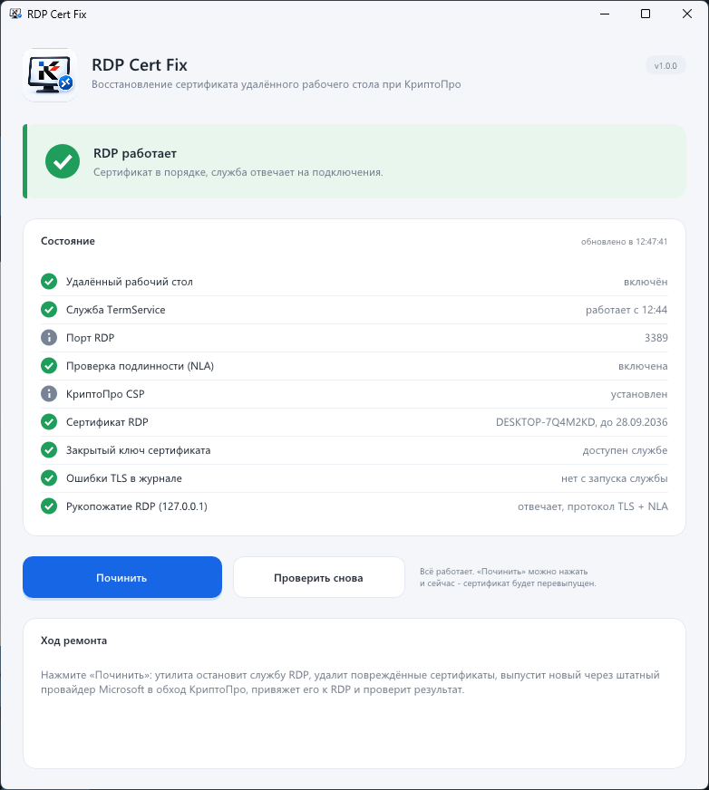

<p align="center"></p>

<h1 align="center">RDP Cert Fix</h1>

<p align="center">Восстановление сертификата удалённого рабочего стола Windows, сломанного КриптоПро CSP.<br>
Одна кнопка, без установки и без зависимостей.</p>

<p align="center"></p>

<p align="center"><a href="../../releases/latest"><b>Скачать rdp-cert-fix.exe</b></a></p>

---

## Как проявляется

- RDP-клиент (mstsc, Microsoft Remote Desktop на телефоне и т.п.) сразу отваливается или пишет «Внутренняя ошибка» / «Не удаётся подключиться к удалённому компьютеру».
- Причём не пускает **никого**: ни из интернета, ни из локальной сети. Пароль ни при чём - до ввода пароля дело не доходит.
- Порт 3389 при этом открыт, служба «Службы удалённых рабочих столов» работает, брандмауэр настроен.
- В журнале **Windows → System** (`eventvwr.msc`) повторяются два события:

| Источник | Код | Текст |
|---|---|---|
| `TerminalServices-RemoteConnectionManager` | **1057** | Серверу узла сеансов удалённых рабочих столов не удалось создать новый самозаверяющий сертификат… Код состояния: **Указан неправильный алгоритм** |
| `Schannel` | **36870** | Произошла неустранимая ошибка при попытке обращения к закрытому ключу учётных данных TLS server. Код ошибки: **0x8009030D** |

Если видите эту пару - это оно.

## Почему ломается

RDP шифрует соединение по TLS. Для TLS серверу нужен сертификат с закрытым ключом. На обычном компьютере никто его специально не выпускает: служба удалённых рабочих столов (`TermService`) при старте сама делает **самоподписанный сертификат** и кладёт его в хранилище `Локальный компьютер → Remote Desktop`. Ключ к нему хранится в `C:\ProgramData\Microsoft\Crypto\RSA\MachineKeys`. Срок у такого сертификата около полугода, после чего служба молча выпускает новый.

**КриптоПро CSP** при установке встраивается в криптографическую подсистему Windows (CryptoAPI и Schannel), чтобы работать с ГОСТ-сертификатами и ГОСТ-TLS. Это видно и по списку шифров TLS: в нём появляются наборы `TLS_GOSTR341112_256_WITH_KUZNYECHIK_…`. Побочный эффект такой: служба RDP, которая выпускает свой сертификат старым способом, получает от криптоподсистемы ошибку **«Указан неправильный алгоритм»** (`NTE_BAD_ALGID`) и сертификат не создаёт. Уже существующий ключ Schannel открыть тоже не может (`0x8009030D`, `SEC_E_UNKNOWN_CREDENTIALS`).

Итог: сервер принимает TCP-подключение, но ему нечем начать TLS-рукопожатие, и он просто закрывает соединение.

Поэтому поломка часто выглядит как «RDP работал и вдруг перестал»:

- поставили или обновили КриптоПро - всё работает, пока жив старый сертификат;
- через несколько месяцев сертификат истёк, служба пытается сделать новый - и не может;
- то же бывает после крупного обновления Windows или после того, как кто-то «почистил» сертификаты или ключи.

Удалять КриптоПро не нужно, да и часто нельзя: он нужен для ЭЦП, ЕГАИС, ЭДО, банк-клиентов.

## Как чинится

Надо сделать самим то, что служба RDP сделать не может: выпустить сертификат через **штатный провайдер Microsoft** в обход КриптоПро и явно указать RDP использовать его. Программа делает это по кнопке «Починить»:

1. **Останавливает службы** `UmRdpService` и `TermService`, чтобы они не держали старый ключ.
2. **Удаляет сломанное**: сертификаты из хранилища `Remote Desktop` и ранее выпущенные этой программой сертификаты вместе с их закрытыми ключами.
3. **Выпускает новый сертификат**: самоподписанный, `CN=<имя компьютера>`, RSA-2048, SHA-256, назначение Server Authentication, срок 10 лет. Ключ создаётся в **Microsoft Software Key Storage Provider** (CNG) - КриптоПро в этом не участвует. Сертификат кладётся в `Локальный компьютер → Личное`.
4. **Даёт службе доступ к ключу.** `TermService` работает от имени `NETWORK SERVICE`, и без явного права на чтение ключа TLS снова не поднимется.
5. **Привязывает сертификат к RDP**: пишет его отпечаток в `HKLM\SYSTEM\CurrentControlSet\Control\Terminal Server\WinStations\RDP-Tcp\SSLCertificateSHA1Hash`. Это то же самое, что делает `Win32_TSGeneralSetting` через WMI. Раз сертификат указан явно, служба больше не пытается выпускать свой.
6. **Запускает службы и проверяет**: отправляет на `127.0.0.1` настоящий запрос подключения RDP (X.224 Connection Request) и ждёт ответа сервера.

Сертификат выпущен на 10 лет, поэтому через полгода поломка не вернётся.

Что стоит знать:

- При перезапуске службы активные RDP-сеансы отключатся, но **не завершатся** - к ним можно сразу переподключиться. Если вы работаете по RDP, соединение на пару секунд оборвётся.
- Клиент при первом подключении предупредит, что сертификат самоподписанный и не проверен. Это нормально: такой же был и раньше, просто теперь новый. Примите его.
- Событие 1057 при старте службы может появляться и дальше: Windows всё равно пробует сделать свой сертификат. Но работает она на привязанном, так что на подключения это не влияет. Важно, чтобы не было **Schannel 36870** - программа их и показывает.
- Если у вас в RDP был привязан сертификат от своего центра сертификации, программа его не удаляет, но перепривязывает RDP на новый.

## Что проверяет программа

При запуске и по кнопке «Проверить снова»:

| Проверка | Что значит |
|---|---|
| Удалённый рабочий стол | включён ли в настройках или групповой политике |
| Служба TermService | работает ли и с какого времени |
| Порт RDP, NLA | справочно |
| КриптоПро CSP | установлен ли (типичная причина поломки) |
| Сертификат RDP | какой привязан, чей, до какого числа |
| Закрытый ключ | открывается ли и есть ли к нему доступ у службы |
| Ошибки TLS в журнале | события Schannel 36870 с момента запуска службы |
| Рукопожатие RDP | реальный запрос к `127.0.0.1` - отвечает ли сервер |

## Запуск

Скачайте `rdp-cert-fix.exe` из [Releases](../../releases/latest) и запустите - права администратора программа запросит сама.

Режим без окна для скриптов и удалённого запуска (например, через PsExec или планировщик). Журнал пишется в `%TEMP%\rdp-cert-fix.log`:

| Ключ | Действие | Код возврата |
|---|---|---|
| `/check` | только проверка | 0 - работает, 3 - сломан, 4 - RDP выключен |
| `/fix` | ремонт и проверка | 0 - успех, 2 - с предупреждениями, 1 - ошибка |

## Как починить вручную (без программы)

То же самое в PowerShell от администратора:

```powershell
$cert = New-SelfSignedCertificate -Subject "CN=$env:COMPUTERNAME" -DnsName $env:COMPUTERNAME `
    -CertStoreLocation Cert:\LocalMachine\My -KeyAlgorithm RSA -KeyLength 2048 -HashAlgorithm SHA256 `
    -Provider "Microsoft Software Key Storage Provider" -NotAfter (Get-Date).AddYears(10) `
    -TextExtension @("2.5.29.37={text}1.3.6.1.5.5.7.3.1")
$key = [Security.Cryptography.X509Certificates.RSACertificateExtensions]::GetRSAPrivateKey($cert)
icacls "$env:ProgramData\Microsoft\Crypto\Keys\$($key.Key.UniqueName)" /grant "*S-1-5-20:R"
$ts = Get-CimInstance -Namespace root\cimv2\TerminalServices -ClassName Win32_TSGeneralSetting -Filter "TerminalName='RDP-Tcp'"
Set-CimInstance -InputObject $ts -Property @{ SSLCertificateSHA1Hash = $cert.Thumbprint }
Restart-Service TermService -Force
```

## Сборка

Нужна Visual Studio 2022 или новее с компонентом «Разработка классических приложений на C++». Запустите `build.bat` - получится `rdp-cert-fix.exe` (x64, статический CRT, манифест с запросом прав администратора).

Интерфейс сделан на [Dear ImGui](https://github.com/ocornut/imgui) 1.91.9b (MIT) + Direct3D 11, исходники лежат в `vendor/`.
